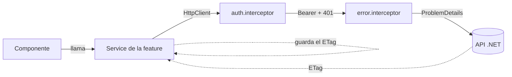
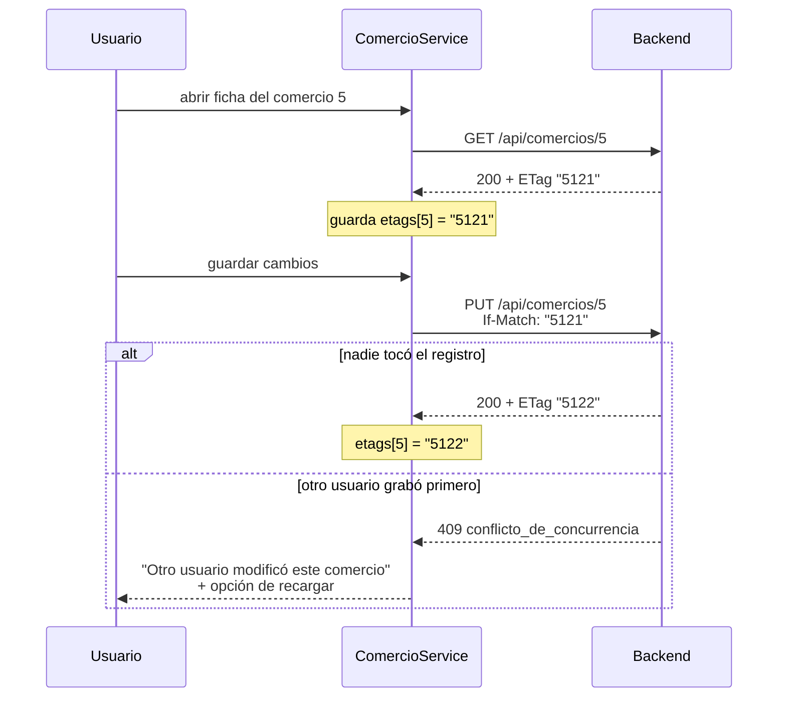

# ZOCO Tasks — Frontend

Aplicación interna para que un equipo comercial registre comercios interesados en
ZOCO y les haga seguimiento por un embudo de estados, con registro de
interacciones y análisis de oportunidad generado por IA.

Angular 20 · standalone components · TypeScript strict · backend en
[ASP.NET Core + PostgreSQL](https://github.com/valentin21103).

Este documento explica **cómo levantarlo, cómo está armado y por qué**. Cada
decisión sigue el mismo formato que el `DECISIONES.md` del backend —
**contexto → decisión → por qué → cuándo elegiría distinto**— para que los dos
repositorios se lean como un solo proyecto. La última parte es la que importa
más de lo que parece: una decisión sin condición de reversión es un dogma, no
una decisión de ingeniería.

---

## Índice

- [Cómo levantarlo](#cómo-levantarlo)
- [Configuración](#configuración)
- [Deploy](#deploy)
- [Qué resuelve](#qué-resuelve)
- [Estructura de carpetas](#estructura-de-carpetas)
- [Cómo fluyen los datos](#cómo-fluyen-los-datos)
- [Decisiones](#decisiones)
- [Mapa de errores](#mapa-de-errores)
- [Qué queda afuera](#qué-queda-afuera)
- [Comandos](#comandos)
- [Estado](#estado)

---

## Cómo levantarlo

Requiere Node 20 o superior y el backend corriendo.

```bash
npm install
npm start
```

Queda en `http://localhost:4200`, apuntando a `http://localhost:5279`.

```bash
cd zocotasks-backend
dotnet run --project ZocoTasks.API
```

### Usuarios para probar

El backend siembra estos usuarios la primera vez que arranca contra una base
vacía:

| Email | Contraseña | Rol |
|---|---|---|
| `admin@zoco.test` | `Admin123!` | Admin |
| `vendedor1@zoco.test` | `Vendedor123!` | Vendedor |
| `vendedor2@zoco.test` | `Vendedor123!` | Vendedor |

El login tiene rate limiting (pocos intentos por minuto por IP): si se prueba
varias veces seguidas, el backend responde 429 y el front lo avisa.

## Configuración

Angular resuelve la configuración **en tiempo de compilación**, no con
variables de entorno del sistema. Todo lo configurable vive en
`src/environments/`:

| Archivo | Cuándo se usa | `apiUrl` |
|---|---|---|
| `environment.ts` | `npm start` y build de desarrollo | `http://localhost:5279` |
| `environment.prod.ts` | `npm run build` (producción) | URL del backend desplegado |

El reemplazo lo hace `fileReplacements` en `angular.json`. Para apuntar a otro
backend, se edita el archivo que corresponda; no hay ningún otro lugar donde la
URL esté escrita.

No hay secretos en este repositorio: **un frontend no puede guardar secretos**,
porque todo lo que se compila llega al navegador del usuario. El JWT lo emite
el backend y se guarda en `localStorage` solo durante la sesión.

## Deploy

API en producción sobre Render; el frontend se despliega como sitio estático
apuntando a esa API.

**Por qué es tan simple.** Es una SPA sin servidor propio: solo hay que
publicar los archivos y redirigir toda ruta a `index.html` para que el router
de Angular la resuelva del lado del cliente. Sin esa redirección, refrescar la
página en `/comercios/5` da 404 en vez de volver a montar la aplicación.

Sin variables de entorno en el hosting del front: `environment.prod.ts` ya
trae la URL de la API, y no es un secreto — es la dirección pública del
backend. `AllowAnyOrigin()` en el CORS del backend hace que el dominio del
front funcione sin whitelist.

Build de producción:

```bash
npm run build
# archivos servibles en dist/zocotasks-front/browser
```

## Qué resuelve

Un vendedor registra comercios interesados en ZOCO y los sigue por un embudo
de estados:

```
Nuevo → Contactado → Interesado → Documentación → Aprobado / Rechazado
```

Sobre cada comercio se registran interacciones (llamada, WhatsApp, reunión,
email, nota interna) y se puede pedir un **análisis de oportunidad** generado
por IA: resumen, nivel de interés, próximo paso, tres preguntas para el
vendedor y datos faltantes.

Tres problemas mandan sobre el diseño del front, y casi todas las decisiones
de abajo giran alrededor de ellos:

1. **La concurrencia optimista.** Toda escritura sobre un comercio exige el
   header `If-Match` con el ETag que devolvió el `GET`. Si el front se olvida
   de mandarlo, el backend responde `428`; si lo manda vencido, `409`.
2. **La validación server-side.** El backend devuelve los errores campo por
   campo, y el front tiene que mostrarlos **en el campo**, no en un cartel
   genérico.
3. **La autorización por rol.** Admin puede todo; Vendedor puede todo menos
   eliminar y administrar rubros. La decide siempre el backend.

## Estructura de carpetas

```
src/
├── environments/            environment.ts · environment.prod.ts   (apiUrl)
└── app/
    ├── app.config.ts        providers: router, http + interceptores, locale es-AR
    ├── app.routes.ts        /login suelto · el resto bajo el layout con authGuard
    │
    ├── core/                lo que existe una sola vez en toda la aplicación
    │   ├── auth/            auth.service.ts · auth.guard.ts · admin.guard.ts · login/
    │   ├── interceptors/    auth.interceptor.ts · error.interceptor.ts
    │   └── layout/          layout.component + sidebar/
    │
    ├── features/            una carpeta por pantalla, con su servicio adentro
    │   ├── comercios/       listado: buscar · filtrar · ordenar · paginar
    │   └── comercio-detalle/ ficha · interacciones · embudo · analizar oportunidad
    │
    └── shared/               lo que usan dos o más features
        ├── components/       formularios, modal, ABM de rubros, badge de estado
        ├── models/           interfaces y DTOs, uno por entidad
        ├── services/         catalogo.service.ts · rubro.service.ts · notificacion.service.ts
        ├── directives/       sort.directive.ts
        └── util/             helpers sin dependencias de Angular
```

**El criterio de qué va dónde**, que es lo único que hay que recordar:

| Carpeta | Regla |
|---|---|
| `core/` | Existe **una sola vez** en la aplicación: la sesión, el layout, los interceptores |
| `features/` | Tiene **una ruta**. Si no se navega hacia ello, no es una feature |
| `shared/` | Lo usan **dos o más** features. Con un solo consumidor, vive dentro de esa feature |

El servicio de cada feature vive **dentro de la carpeta de la feature**
(`features/comercios/comercio.service.ts`), no en un `services/` global. Así
una pantalla es una unidad completa: se abre una carpeta y está todo lo que la
hace funcionar.

## Cómo fluyen los datos



El componente **nunca** toca `HttpClient` ni arma headers. Pide
`Actualizar(id, dto)` y el servicio se ocupa del resto.

### El ciclo de concurrencia, que es el corazón del front

Es el requisito destacado de la consigna: dos usuarios no deben poder pisarse
el mismo registro sin detectarlo.



## Decisiones

### Angular 20 con standalone components

Es lo más nuevo que no obliga a pelear con defaults recién introducidos
—aplicaciones *zoneless*, naming de archivos sin sufijo— dentro de una prueba
con límite de tiempo. Standalone elimina la capa de módulos, que en una
aplicación de dos pantallas es ceremonia pura: cada componente declara sus
propios imports y se ve de un vistazo qué usa.

**Cuándo elegiría distinto.** En un proyecto que va a vivir años, arrancaría
directamente en la última versión y absorbería el costo de aprender los
defaults nuevos.

### El ETag se encapsula en el servicio, no en el componente

**El problema.** Toda escritura sobre un comercio necesita el ETag del último
`GET`. Si cada componente lo guardara por su cuenta, alcanza con **un** camino
que se olvide para comer un `428` en producción.

**Decisión.** `ComercioService` mantiene un `Map<number, string>` de ETags. El
`GET` de detalle usa `observe: 'response'`, guarda el header, y
`Actualizar()` y `CambiarEstado()` lo reenvían solos.

**Por qué.** Convierte el `428` en un error **imposible por construcción** en
lugar de en algo que hay que recordar. Ningún componente conoce la existencia
del header: la regla vive en un solo archivo.

**Detalle no obvio.** El navegador no deja leer headers de respuesta fuera de
la lista segura. Esto funciona solo porque el backend expone `ETag` vía CORS
con `WithExposedHeaders("ETag")`; sin esa línea del lado del servidor, toda la
concurrencia optimista se cae en silencio.

**Cuándo elegiría distinto.** Con edición offline o con varias pestañas
editando el mismo registro, el cache en memoria no alcanza y habría que
persistirlo junto con el borrador del formulario.

### Dos interceptores, una responsabilidad cada uno

`auth.interceptor` adjunta el Bearer y reacciona al `401` cerrando la sesión.
`error.interceptor` traduce los `ProblemDetails` del backend a mensajes.

**Por qué separados.** Cambian por razones distintas: uno se toca cuando
cambia la autenticación, el otro cuando el backend agrega un código de error.
Mezclarlos hace que cada cambio obligue a leer lógica que no tiene nada que
ver.

**Por qué el token se adjunta solo si la URL es la del backend propio.**
Mandar el JWT a un dominio de terceros es filtrar una credencial. El
interceptor compara contra `environment.apiUrl` antes de agregar el header.

### Los errores se discriminan por `codigo`, nunca por el texto

**El problema.** El backend devuelve `ProblemDetails` (RFC 7807) con un campo
`codigo`. **Dos errores distintos comparten el status 409**:
`conflicto_de_concurrencia` y `estado_transicion_invalida`.

**Decisión.** El front rutea por `codigo`. El status solo decide la
severidad.

**Por qué.** Mirar únicamente el status mezclaría "otro usuario te pisó el
registro" con "esa transición no existe", que son problemas sin nada en común
para el usuario. Y comparar el texto del mensaje es peor: cualquier ajuste de
redacción en el backend rompería el front en silencio.

### El `400` se pinta campo por campo

El diccionario `errors` del `ProblemDetails` se mapea a los controles del
formulario reactivo: la clave llega en **PascalCase** (`NombreComercial`), se
convierte a camelCase y se aplica `control.setErrors({ servidor: mensaje })`.

**Por qué.** La validación server-side pesa en la evaluación, pero solo se
**ve** si el usuario la percibe donde corresponde. Un cartel que dice "hay
datos inválidos" obliga a adivinar cuál; el mismo error debajo del campo de
CUIT se entiende sin leer.

Se valida también en el cliente (obligatorios, largos, formato de email, CUIT
de once dígitos) para dar respuesta inmediata, pero **la validación del
cliente es usabilidad, no seguridad**: la que manda es la del servidor, y por
eso sus errores se muestran aunque el formulario haya pasado la validación
local.

Con un corolario que conviene dejar escrito: **el cliente nunca puede ser más
estricto que el servidor.** Si el backend acepta un dato y el formulario lo
rechaza, el usuario se queda con algo válido que el sistema no le deja
cargar, y sin forma de entender por qué. Más permisivo se puede —el servidor
rechaza después—; al revés, no.

### El selector de estado se arma con `transicionesPosibles`

El combo de cambio de estado se llena con el array `transicionesPosibles` que
devuelve el detalle del backend, nunca con una lista propia. Hoy el
movimiento entre estados es libre —se puede avanzar, retroceder o reabrir una
oportunidad cerrada—, así que ese array trae todos los estados menos el
actual.

**Por qué igual se arma con ese campo y no con una lista fija en el
frontend.** Porque la regla vive **de un solo lado**. El día que el backend
vuelva a restringir el pipeline, los botones se habilitan o deshabilitan
solos, sin tocar el front. Hardcodear los estados obligaría a duplicar la
máquina de estados acá y mantenerla sincronizada a mano.

El `409` por transición inválida se maneja igual, como red de seguridad para
el caso en que el estado haya cambiado desde otra pestaña.

### Los rubros se cachean y tienen su propio ABM; los tipos de interacción no

`CatalogoService` pide estados y rubros una sola vez y los guarda en signals.
Los tipos de interacción (Llamada, WhatsApp, Reunión, Email, Nota interna)
**no** se piden al backend: viven en una lista fija del frontend, junto con el
ícono y el color de cada uno.

**Por qué la diferencia.** Los rubros pueden cambiar sin que cambie el
código: son una tabla con ABM del lado del backend. Los tipos de interacción
son un enum del dominio — agregar uno exige tocar el backend y desplegar. Si
igual hay que tocar código para agregar un tipo nuevo, pedirle la lista al
servidor no ahorra nada; solo agrega un viaje de red que puede fallar.

Como los rubros sí cambian en caliente, el frontend además tiene un **ABM
completo** (crear, renombrar, dar de baja), accesible desde el formulario de
comercio con el rol Admin. La baja tiene dos comportamientos: si ningún
comercio usa el rubro, se borra de verdad; si alguno lo usa, se desactiva
—sale del combo para altas nuevas, pero los comercios históricos lo siguen
mostrando—, porque un borrado físico rompería esas referencias.

### El estado del listado vive en la URL

Búsqueda, filtros, orden y página son `queryParams`. El componente los lee de
la ruta y dispara la consulta; no mantiene una copia propia.

**Por qué.** Tres cosas gratis: refrescar la página no pierde el contexto, el
botón "atrás" del navegador funciona como el usuario espera, y un listado
filtrado se puede compartir por link. Además elimina la clase de bugs donde
la URL y lo que se ve en pantalla dicen cosas distintas.

**Detalle.** El buscador aplica `debounce` de 300 ms. Sin eso se dispara una
consulta por tecla.

### Autenticación: la sesión en un signal, los permisos en el backend

`AuthService` guarda el JWT en `localStorage` y expone la sesión como
`signal<Sesion | null>`, con los datos leídos de los claims del token. Dos
roles:

| | Admin | Vendedor |
|---|---|---|
| Ver, buscar, filtrar | ✅ | ✅ |
| Crear y editar comercios | ✅ | ✅ |
| Cambiar estado, registrar interacciones | ✅ | ✅ |
| Analizar oportunidad | ✅ | ✅ |
| **Eliminar** | ✅ | ❌ |
| **Administrar rubros** | ✅ | ❌ |

**Por qué un signal y no un `BehaviorSubject`.** El template se suscribe solo
con `auth.sesion()`, sin `async` pipe ni riesgo de suscripciones colgadas.

**Lo importante, dicho explícitamente: esconder un botón no es seguridad.**
El `adminGuard` y los `@if (auth.esAdmin())` existen para que el usuario no
intente algo que va a terminar en un `403`. **Quien autoriza de verdad es el
backend**, con `[Authorize(Roles = "Admin")]` en los endpoints de borrado y de
administración de rubros. Cualquiera puede abrir las herramientas de
desarrollo y volver a mostrar el botón: si esa fuera la única defensa, no
habría defensa.

**Por qué los claims se leen en el cliente.** Decodificar el payload del JWT
evita un request extra para saber quién está logueado. No se verifica la
firma del lado del cliente **y no hace falta**: el token no se usa para tomar
decisiones de seguridad acá, solo para pintar la interfaz.

### "Analizar oportunidad" es una solapa, no un botón suelto

La ficha del comercio tiene dos vistas: **Detalle** y **Analizar
oportunidad**, como pestañas. Cambiar de vista no dispara nada; el análisis
se pide con un botón explícito dentro de esa vista, y el resultado queda en
memoria mientras la ficha esté abierta.

**Por qué es una pestaña y no un botón en el detalle.** El análisis no es una
acción más sobre el comercio: es otra forma de mirarlo. Ponerlo como una
sección más entre el teléfono y las notas le restaría el peso que tiene.

**Por qué no se dispara solo al entrar a la pestaña.** Cada análisis llama a
un proveedor de IA externo: cuesta tiempo (2 a 5 segundos) y cuota. Si se
disparara solo, cada clic accidental en la pestaña sería una llamada
innecesaria.

**Cómo se maneja la respuesta degradada.** Si el proveedor de IA falla, el
backend igual responde `200` con `esDegradado: true` y
`nivelInteres: "Indeterminado"` — nunca un 500. El front lo muestra como un
aviso ("no se pudo generar el análisis ahora"), no como si fuera un resultado
válido con bajo interés: son dos cosas distintas y mezclarlas sería mentir
sobre el nivel de interés real.

## Mapa de errores

Qué hace el front con cada respuesta del backend:

| Status | `codigo` | Qué hace el front |
|---|---|---|
| **400** | — | Pinta cada error en su campo del formulario |
| **401** | — | Cierra la sesión y manda a `/login` |
| **403** | — | Aviso de "no tenés permiso". Es un rol insuficiente, no un bug |
| **404** | `entidad_no_encontrada` | Vuelve al listado con un aviso |
| **409** | `conflicto_de_concurrencia` | "Otro usuario modificó este comercio" + botón de recargar |
| **409** | `estado_transicion_invalida` | Mensaje de pipeline y refresco de `transicionesPosibles` |
| **422** | `regla_de_negocio` | Mensaje del backend tal cual: CUIT repetido, rubro dado de baja |
| **428** | `precondicion_requerida` | **Es un bug del front**: se registra en consola, no se le muestra al usuario un error que no puede resolver |
| **429** | — | Rate limiting del login: "esperá un minuto y volvé a probar" |
| **500** | `error_interno` | Mensaje genérico. El detalle no se expone en producción |

## Qué queda afuera

Decisiones de no hacer, con el motivo:

- **Sin librería de estado global** (NgRx, Signal Store). La aplicación tiene
  pocas pantallas y el estado del servidor no se comparte entre ellas: los
  servicios con signals alcanzan. Un store agregaría boilerplate sin resolver
  un problema que hoy no existe.
- **Sin caché de listados.** Cada navegación al listado vuelve a consultar.
  Con concurrencia optimista de por medio, mostrar datos viejos es
  exactamente lo que el proyecto intenta evitar.
- **Sin i18n.** La aplicación es interna y en español. `LOCALE_ID` en
  `es-AR` para que las fechas y los números se vean como corresponde.

## Comandos

| Comando | Qué hace |
|---|---|
| `npm start` | Servidor de desarrollo con recarga en caliente |
| `npm run build` | Build de producción en `dist/` |
| `npm test` | Tests unitarios (Karma + Jasmine) |
| `npm run watch` | Build de desarrollo en modo watch |

## Estado

| Bloque | Estado |
|---|---|
| Estructura, configuración y documentación | ✅ |
| Capa de API: modelos, servicios, interceptores | ✅ |
| Autenticación: login, guards, roles | ✅ |
| Listado con búsqueda, filtros, orden y paginación | ✅ |
| Alta y edición con validación reactiva | ✅ |
| Ficha del comercio e interacciones | ✅ |
| Cambio de estado y manejo del conflicto 409 | ✅ |
| ABM de rubros | ✅ |
| Analizar oportunidad | ✅ |
| Deploy | ✅ |
