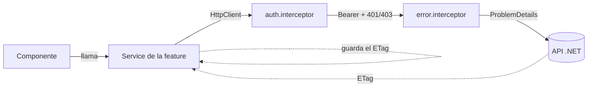
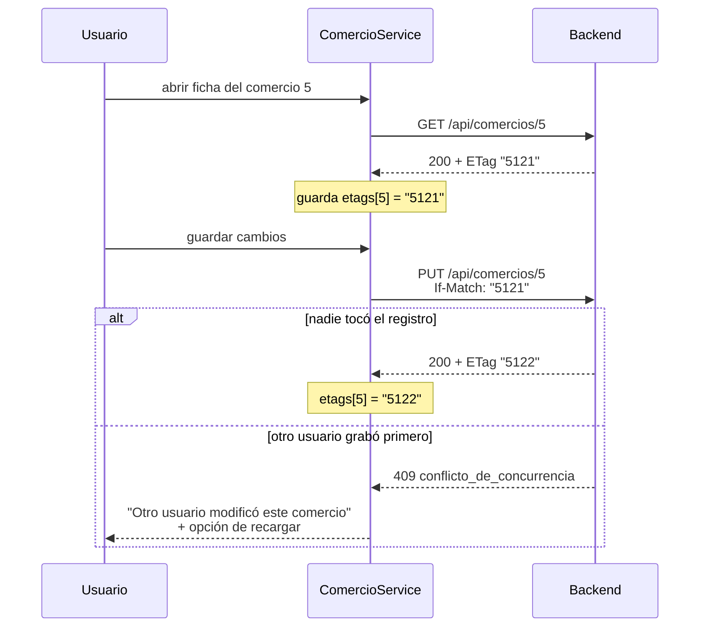

# Arquitectura del frontend — ZOCO Tasks

Este documento explica **cómo está organizado el frontend y por qué**. Sigue el
mismo formato que el `DECISIONES.md` del backend —
**contexto → opciones → decisión → por qué → cuándo elegiría distinto**— para que
los dos repositorios se lean como un solo proyecto.

La última parte de cada decisión es la importante: una decisión sin condiciones
de reversión es un dogma, no una decisión de ingeniería.

- **Backend**: [zocotasks-backend](https://github.com/valentin21103) · ASP.NET Core 10 + PostgreSQL
- **Framework**: Angular 20, standalone components
- **API en desarrollo**: `http://localhost:5279`

---

## Índice

- [1. Qué resuelve este frontend](#1-qué-resuelve-este-frontend)
- [2. Estructura de carpetas](#2-estructura-de-carpetas)
- [3. Cómo fluyen los datos](#3-cómo-fluyen-los-datos)
- [4. Decisiones](#4-decisiones)
- [5. Mapa de errores](#5-mapa-de-errores)
- [6. Qué queda afuera](#6-qué-queda-afuera)

---

## 1. Qué resuelve este frontend

Herramienta interna para un equipo comercial: registrar comercios interesados en
ZOCO y seguirlos por un embudo que **no admite retrocesos**.

```
Nuevo → Contactado → Interesado → Documentación → Aprobado
  └───────────────────────────────────────────→ Rechazado
```

Sobre cada comercio se registran interacciones (llamada, WhatsApp, reunión,
email, nota interna) y se puede pedir un **análisis de oportunidad** generado por
un modelo de lenguaje.

Dos problemas mandan sobre el diseño del front, y las decisiones de abajo giran
casi todas alrededor de ellos:

1. **La concurrencia optimista.** Toda escritura sobre un comercio exige el
   header `If-Match` con el ETag que devolvió el `GET`. Si el front se olvida de
   mandarlo, el backend responde `428`; si lo manda vencido, `409`.
2. **La validación server-side.** El backend devuelve los errores campo por
   campo, y el front tiene que mostrarlos **en el campo**, no en un cartel
   genérico.

---

## 2. Estructura de carpetas

```
src/
├── environments/            environment.ts · environment.prod.ts   (apiUrl)
└── app/
    ├── app.config.ts        providers: router, http + interceptores, locale es-AR
    ├── app.routes.ts        /login suelto · el resto bajo el layout con authGuard
    │
    ├── core/                lo que existe una sola vez en toda la aplicación
    │   ├── auth/            auth.service.ts · auth.guard.ts · admin.guard.ts · login/
    │   ├── interceptors/    auth.interceptor.ts · error.interceptor.ts
    │   └── layout/          layout.component + sidebar/
    │
    ├── features/            una carpeta por pantalla, con su servicio adentro
    │   ├── comercios/       listado: buscar · filtrar · ordenar · paginar
    │   └── comercio-detalle/ ficha · interacciones · analizar oportunidad
    │
    └── shared/              lo que usan dos o más features
        ├── components/      formularios y diálogos reutilizables
        ├── models/          interfaces y DTOs, uno por entidad
        ├── services/        catalogo.service.ts
        ├── directives/      sort.directive.ts
        └── util/            helpers sin dependencias de Angular
```

**El criterio de qué va dónde**, que es lo único que hay que recordar:

| Carpeta | Regla |
|---|---|
| `core/` | Existe **una sola vez** en la aplicación: la sesión, el layout, los interceptores |
| `features/` | Tiene **una ruta**. Si no se navega hacia ello, no es una feature |
| `shared/` | Lo usan **dos o más** features. Con un solo consumidor, vive dentro de esa feature |

El servicio de cada feature vive **dentro de la carpeta de la feature**
(`features/comercios/comercio.service.ts`), no en un `services/` global. Así una
pantalla es una unidad completa: se abre una carpeta y está todo lo que la hace
funcionar.

---

## 3. Cómo fluyen los datos



El componente **nunca** toca `HttpClient` ni arma headers. Pide `Actualizar(id, dto)`
y el servicio se ocupa del resto.

### El ciclo de concurrencia, que es el corazón del front



---

## 4. Decisiones

### 4.1 Angular 20 con standalone components

**Contexto.** La última versión al momento de arrancar es la 22; la 19 es la que
más conozco.

**Decisión.** Angular 20 LTS, standalone, sin `NgModule`.

**Por qué.** Es lo más nuevo que no obliga a pelear con defaults recién
introducidos —aplicaciones *zoneless*, naming de archivos sin sufijo— dentro de
una prueba con límite de tiempo. Standalone elimina la capa de módulos, que en
una aplicación de dos pantallas es ceremonia pura: cada componente declara sus
propios imports y se ve de un vistazo qué usa.

**Cuándo elegiría distinto.** En un proyecto que va a vivir años, arrancaría
directamente en la última y absorbería el costo de aprender los defaults nuevos.

---

### 4.2 El ETag se encapsula en el servicio, no en el componente

**Contexto.** Toda escritura sobre un comercio necesita el ETag del último `GET`.
Alguien tiene que guardarlo y reenviarlo.

**Opciones.**

| Opción | Problema |
|---|---|
| Cada componente guarda el ETag en una variable | Alcanza con **un** camino que se olvide para comer un `428` en producción |
| Guardarlo en el modelo y mandarlo desde el componente | Mismo problema, movido de lugar |
| **Un cache dentro de `ComercioService`** | Ninguno relevante |

**Decisión.** `ComercioService` mantiene un `Map<number, string>` de ETags. El
`GET` de detalle usa `observe: 'response'`, guarda el header, y `Actualizar()` y
`CambiarEstado()` lo reenvían solos.

**Por qué.** Convierte el `428` en un error **imposible por construcción** en
lugar de en algo que hay que recordar. Ningún componente conoce la existencia del
header: la regla vive en un solo archivo, y ese archivo es el único que hay que
revisar si algo falla.

**Detalle no obvio.** El navegador no deja leer headers de respuesta fuera de la
lista segura. Esto funciona solamente porque el backend expone `ETag` vía CORS
con `WithExposedHeaders("ETag")`; sin esa línea del lado del servidor, toda la
concurrencia optimista se cae en silencio.

**Cuándo elegiría distinto.** Con edición offline o con varias pestañas
editando el mismo registro, el cache en memoria no alcanza y habría que
persistirlo junto con el borrador del formulario.

---

### 4.3 Dos interceptores, una responsabilidad cada uno

**Decisión.** `auth.interceptor` adjunta el Bearer y reacciona al `401`/`403`.
`error.interceptor` traduce los `ProblemDetails` del backend a mensajes.

**Por qué.** Son dos ejes que cambian por razones distintas: uno se toca cuando
cambia la autenticación, el otro cuando el backend agrega un código de error.
Mezclarlos en un archivo hace que cada cambio obligue a leer lógica que no tiene
nada que ver.

**Por qué el token se adjunta solo si la URL es la del backend propio.** Mandar
el JWT a un dominio de terceros es filtrar una credencial. El interceptor compara
contra `environment.apiUrl` antes de agregar el header.

---

### 4.4 Los errores se discriminan por `codigo`, nunca por el texto

**Contexto.** El backend devuelve `ProblemDetails` (RFC 7807) con un campo
`codigo`. **Dos errores distintos comparten el status 409**:
`conflicto_de_concurrencia` y `estado_transicion_invalida`.

**Decisión.** El front rutea por `codigo`. El status solo decide la severidad.

**Por qué.** Mirar únicamente el status mezclaría "otro usuario te pisó el
registro" con "no podés pasar de Nuevo a Aprobado", que son problemas sin nada en
común para el usuario. Y comparar el texto del mensaje es peor: cualquier ajuste
de redacción en el backend rompería el front en silencio.

---

### 4.5 El `400` se pinta campo por campo

**Decisión.** El diccionario `errors` del `ProblemDetails` se mapea a los
controles del formulario reactivo: la clave llega en **PascalCase**
(`NombreComercial`), se convierte a camelCase y se aplica
`control.setErrors({ servidor: mensaje })`.

**Por qué.** La validación server-side pesa en la evaluación, pero solo se **ve**
si el usuario la percibe donde corresponde. Un cartel que dice "hay datos
inválidos" obliga a adivinar cuál; el mismo error debajo del campo de CUIT se
entiende sin leer.

Se valida también en el cliente (obligatorios, largos, formato de email, CUIT por
módulo 11) para dar respuesta inmediata, pero **la validación del cliente es
usabilidad, no seguridad**: la que manda es la del servidor, y por eso sus
errores se muestran aunque el formulario haya pasado la validación local.

---

### 4.6 El selector de estado se arma con `transicionesPosibles`

**Decisión.** El combo de cambio de estado se llena con el array
`transicionesPosibles` que devuelve el detalle, no con la lista completa de
estados.

**Por qué.** El backend ya calculó qué transiciones son válidas desde el estado
actual. Usando eso, **el usuario no puede siquiera elegir una transición
inválida**: el error deja de existir en la interfaz en vez de tener que
manejarse. Hardcodear los seis estados obligaría a duplicar la máquina de estados
en el front y a mantenerla sincronizada a mano.

El manejo del `409` por transición inválida se implementa igual, como red de
seguridad para el caso en que el estado haya cambiado en otra pestaña.

---

### 4.7 Los catálogos se cachean, no se hardcodean

**Decisión.** `CatalogoService` pide estados, rubros y tipos de interacción una
sola vez y los comparte con `shareReplay(1)`.

**Por qué.** Los rubros tienen ABM del lado del backend: agregar "Farmacia" no
debería requerir tocar el frontend. Y al ser listas que no cambian durante una
sesión, pedirlas en cada pantalla es tráfico puro.

---

### 4.8 El estado del listado vive en la URL

**Decisión.** Búsqueda, filtros, orden y página son `queryParams`. El componente
los lee de la ruta y dispara la consulta; no mantiene una copia propia.

**Por qué.** Tres cosas gratis: refrescar la página no pierde el contexto, el
botón "atrás" del navegador funciona como el usuario espera, y un listado
filtrado se puede compartir por link. Además elimina la clase de bugs donde la
URL y lo que se ve en pantalla dicen cosas distintas.

**Detalle.** El buscador aplica `debounce` de 300 ms. Sin eso se dispara una
consulta por tecla.

---

### 4.9 Autenticación: la sesión en un signal, los permisos en el backend

**Decisión.** `AuthService` guarda el JWT en `localStorage` y expone la sesión
como `signal<Sesion | null>`, con los datos leídos de los claims del token. Dos
roles: **Admin** y **Moderador**.

| | Admin | Moderador |
|---|---|---|
| Ver, buscar, filtrar | ✅ | ✅ |
| Crear y editar comercios | ✅ | ✅ |
| Cambiar estado, registrar interacciones | ✅ | ✅ |
| Analizar oportunidad | ✅ | ✅ |
| **Eliminar** | ✅ | ❌ |
| **Alta de rubros y catálogos** | ✅ | ❌ |

**Por qué un signal y no un `BehaviorSubject`.** El template se suscribe solo con
`auth.sesion()`, sin `async` pipe ni riesgo de suscripciones colgadas.

**Lo importante, dicho explícitamente: esconder un botón no es seguridad.** El
`adminGuard` y los `@if (auth.esAdmin())` existen para que el usuario no intente
algo que va a terminar en un `403`. **Quien autoriza de verdad es el backend**,
con `[Authorize(Roles = "Admin")]` en los endpoints de borrado. Cualquiera puede
abrir las herramientas de desarrollo y volver a mostrar el botón: si esa fuera la
única defensa, no habría defensa.

**Por qué los claims se leen en el cliente.** Decodificar el payload del JWT
evita un request extra para saber quién está logueado. No se verifica la firma
del lado del cliente **y no hace falta**: el token no se usa para tomar
decisiones de seguridad acá, solo para pintar la interfaz.

---

## 5. Mapa de errores

Qué hace el front con cada respuesta del backend:

| Status | `codigo` | Qué hace el front |
|---|---|---|
| **400** | — | Pinta cada error en su campo del formulario |
| **401** | — | Cierra la sesión y manda a `/login` |
| **403** | — | Aviso de "no tenés permiso". Es un rol insuficiente, no un bug |
| **404** | `entidad_no_encontrada` | Vuelve al listado con un aviso |
| **409** | `conflicto_de_concurrencia` | "Otro usuario modificó este comercio" + botón de recargar |
| **409** | `estado_transicion_invalida` | Mensaje de pipeline y refresco de `transicionesPosibles` |
| **422** | `regla_de_negocio` | Mensaje del backend tal cual: CUIT repetido, rubro dado de baja |
| **428** | `precondicion_requerida` | **Es un bug del front**: se registra en consola, no se le muestra al usuario un error que no puede resolver |
| **500** | `error_interno` | Mensaje genérico. El detalle no se expone en producción |

---

## 6. Qué queda afuera

Decisiones de no hacer, con el motivo:

- **Sin librería de estado global** (NgRx, Signal Store). La aplicación tiene dos
  pantallas y el estado del servidor no se comparte entre ellas: los servicios
  con signals alcanzan. Un store agregaría boilerplate sin resolver un problema
  que hoy no existe.
- **Sin caché de listados.** Cada navegación al listado vuelve a consultar. Con
  concurrencia optimista de por medio, mostrar datos viejos es exactamente lo que
  el proyecto intenta evitar.
- **Sin i18n.** La aplicación es interna y en español. `LOCALE_ID` en `es-AR`
  para que las fechas y los números se vean como corresponde.
